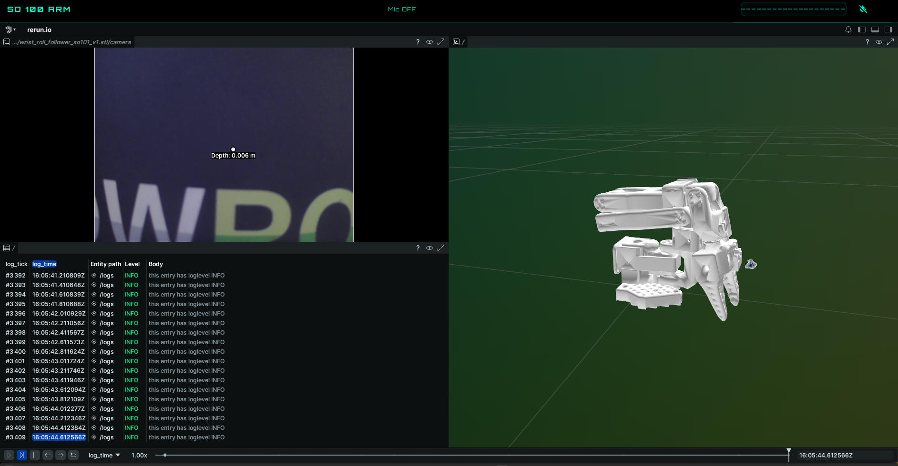

# SO-100 Agent

Voice-controlled SO-100 robotic arm testbed.

This project connects a Rust-based Whisper STT pipeline, a simple TTS layer, a Python MCP agent, and a LeRobot MCP teleoperation server to voice-control the SO-100 arm. It serves as a testbed for future demos like custom policies, reinforcement learning loops, and world/action model experiments.

It serves a web UI for controlling the arm via voice with a live rerun preview (see screenshot).



## Demo

<p align="center">
  <a href="https://app.vidzflow.com/v/7PCM7xIxul" target="_blank">
    
  </a>
</p>

## Architecture

```text

┌──────────────────────────────────────────────────────────┐
│ ollama/                                                  │
│ - LLM endpoint                                           │
│ - VLA for image description                              │
│   http://ollama:11434                                    │
└──────────────────────────────────────────────────────────┘
                          ▲
                          │  HTTP (OpenAI-compat)
                          │
┌────────────────────────────────────────────────────────────────────────────────────────┐
│ controller/                                                                            │
│ - Web UI (:8080) + WebSocket /ws                                                       │
│ - LLM orchestration (Ollama + image-description MCP)                                   │
│ - Robot control (robot-mcp)                                                            │
│ - Audio bridge (Zenoh mic/speaker)                                                     │
└─────────┬───────────────────────────┬──────────────────────────────┬───────────────────┘
          │                           │                              │
          │ HTTP (MCP / RERUN)        │ Zenoh                        │ Zenoh
          │                           │                              │
          ▼                           ▼                             ▼

┌──────────────────────────┐   ┌──────────────────────────┐   ┌──────────────────────────┐
│ lerobot-drive/           │   │ whisper/                 │   │ tts/                     │
│ - SO-100 control         │   │ - sub AUDIO_IN           │   │ - sub LLM_OUTPUT_TEXT    │
│ - MCP server (:9988)     │   │ - pub TRANSCRIPT_TEXT    │   │ - pub AUDIO_OUT          │
│ - Rerun server (:9877)   │   └──────────────────────────┘   └──────────────────────────┘
└──────────────────────────┘


```

### Zenoh topics (current)

- `AUDIO_IN` (bytes): raw PCM s16le mono (browser microphone)
- `TRANSCRIPT_TEXT` (utf-8): ASR output (whisper)
- `AUDIO_OUT` (bytes): raw PCM s16le mono (TTS output for browser playback)

Optional (if enabled in drive):

- `CAMERA_1_IMAGE`, `CAMERA_2_IMAGE` (bytes): raw JPEG bytes

---

## Docker Compose setup

### Prereqs

- Docker + Docker Compose (v2)
- Optional camera device on host (e.g. `/dev/video0`)
- Optional LeRobot gRPC server address reachable by `lerobot-drive` (`LEROBOT_SERVER_ADDRESS`) if you run policy control

### Files

- `docker-compose.yml` at repo root
- `lerobot-drive/calibration.json` (mounted into the drive container)

You need to update the device mounts of `lerobot-drive` to match your actual USB device of the so100-arm as well as the camera. Also update the `CAMERA_1_DEV` to match the camera dev mount you want to use.

### Start

```bash
docker compose build
docker compose up -d
```

### Open the UI

- Web UI: `http://localhost` (Caddy forwards http port 80) network).
- if you run via make87 on a remote machien you can forward the port via `m87 <device-name> forward 80`

### Stop

```bash
docker compose down
```

---

## make87 setup

This repo can be run under make87 as a system deployment. The typical workflow is:

### 1) Pick device and ensure it’s online

```bash
m87 devices list
```

### 2) Deploy with docker-compose on the device

From this repo root:

```bash
m87 <DEVICE_NAME> docker compose up -d --build
```

Follow logs:

```bash
m87 <DEVICE_NAME> docker compose logs -f
```

### 3) Update / redeploy

```bash
m87 <DEVICE_NAME> docker compose build
m87 <DEVICE_NAME> docker compose up -d
```

### 4) Tear down

```bash
m87 <DEVICE_NAME> docker compose down
```
